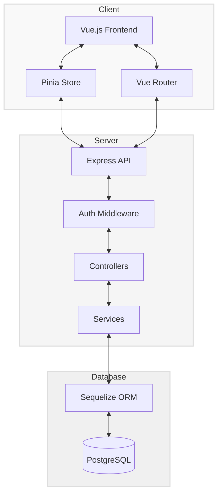

# Task Management System - Architecture Documentation

## System Architecture Overview

The Task Management System is built with a modern, scalable architecture following best practices for web application development. This document outlines the high-level architecture and component interactions.

## Architecture Diagram

## Component Breakdown

### Frontend Components

1. **Vue.js Frontend**
   - Presentation layer built with Vue.js 3 using Composition API
   - Responsive design with custom CSS for all device sizes
   - Light/dark theme support with system detection

2. **Pinia Store**
   - State management for the application
   - Separate stores for Authentication, Tasks, Notifications, and Theme
   - Handles API communication through actions

3. **Vue Router**
   - Client-side routing with navigation guards for protected routes
   - Handles path/query parameters for secure task navigation

### Backend Components

1. **Express API**
   - RESTful API built with Express.js
   - Structured with controllers, services, and models
   - CORS configured for security

2. **Auth Middleware**
   - JWT-based authentication
   - Route protection middleware
   - Session management

3. **Controllers**
   - Handle incoming HTTP requests
   - Input validation
   - Response formatting

4. **Services**
   - Business logic layer
   - Data manipulation
   - Error handling

### Database Components

1. **PostgreSQL**
   - Relational database for data persistence
   - Stores user accounts, tasks, and related data

2. **Sequelize ORM**
   - Object-Relational Mapping for database operations
   - Models define database schema
   - Migrations for version control of database schema

## Data Flow

1. **User Interaction**
   - User interacts with Vue.js components
   - State changes are handled by Pinia stores
   - Router manages navigation between views

2. **API Communication**
   - Axios HTTP client sends requests to Express backend
   - JWT tokens included for authentication
   - Error handling and response processing

3. **Server Processing**
   - Express routes direct requests to appropriate controllers
   - Auth middleware validates tokens
   - Controllers validate inputs and call services
   - Services perform business logic and database operations

4. **Database Operations**
   - Sequelize models perform CRUD operations
   - Relationships enforced by ORM
   - Transaction support for data integrity

## Security Considerations

- JWT authentication with secure token handling
- Password hashing with bcrypt
- Input validation and sanitization to prevent injection attacks
- CORS configuration to control API access
- Secure HTTP headers
- Protected routes requiring authentication
- Session timeout and automatic logout features

## Scalability Considerations

- Stateless backend allows horizontal scaling
- Separate frontend and backend allow independent scaling
- ORM abstraction enables database changes with minimal code changes
- Modular architecture for better maintainability
- Component-based frontend design for reusability

## Error Handling

- Global error handling middleware on backend
- Structured error responses with appropriate HTTP status codes
- Frontend notification system for displaying errors
- Logging for debugging and monitoring
- Graceful degradation for network failures

## Deployment Architecture

The application can be deployed in various configurations:

1. **Development Environment**
   - Local servers for frontend and backend
   - Local PostgreSQL database
   - Hot-reloading for rapid development

2. **Production Environment**
   - Frontend deployed on CDN or static hosting
   - Backend deployed on scalable cloud instances
   - Managed PostgreSQL database service
   - Load balancing for high availability 