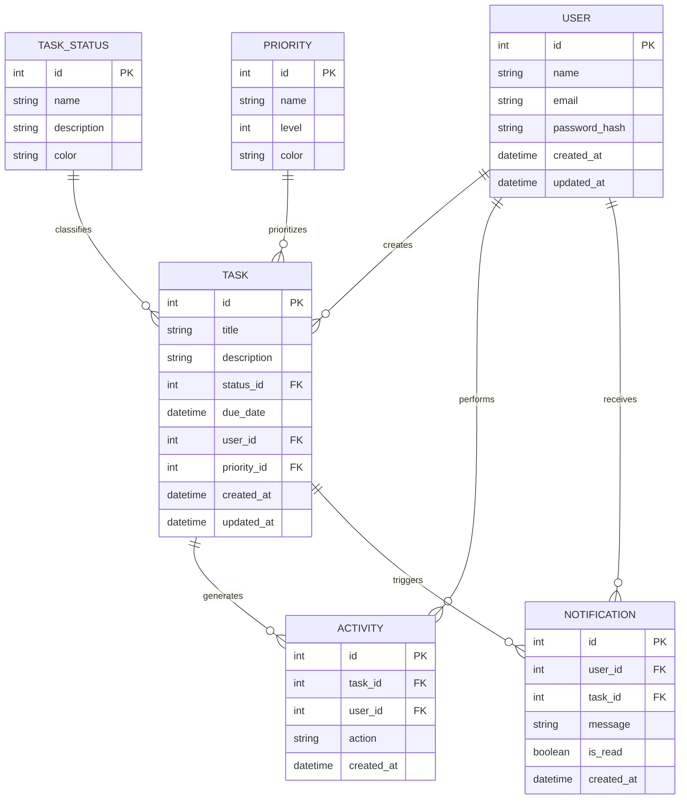
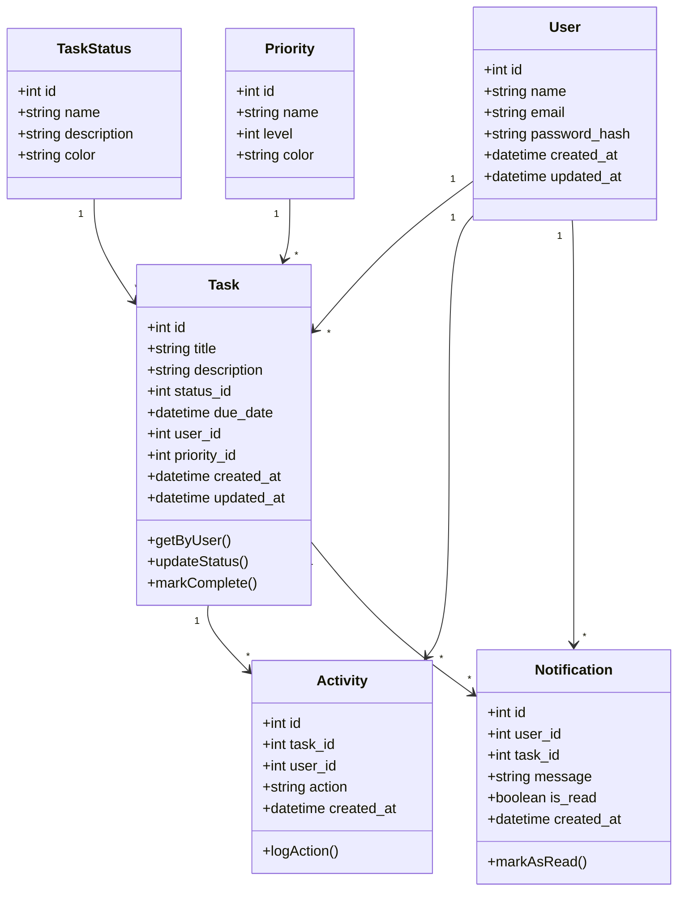
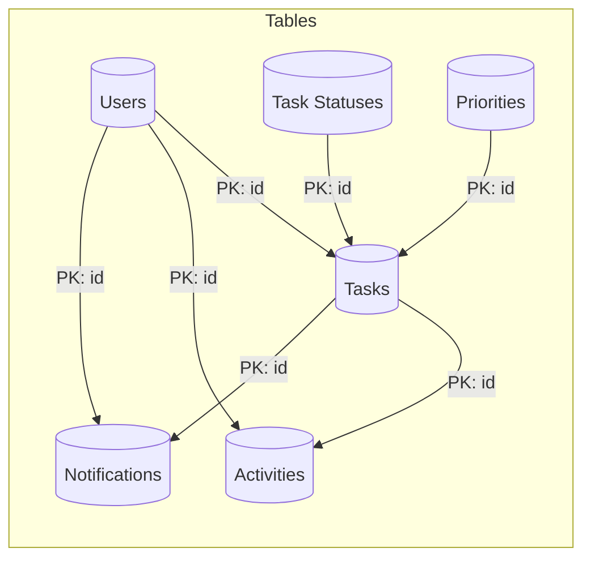
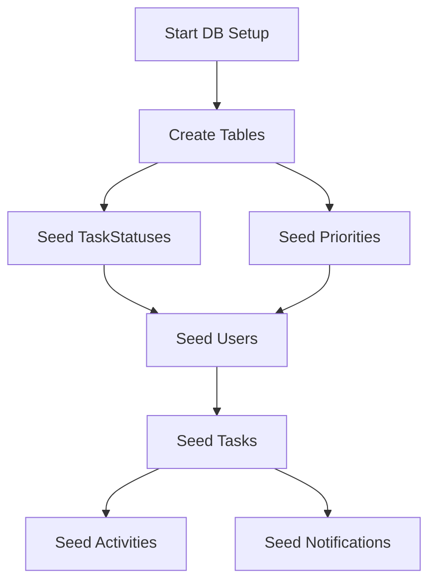

# Data Model Diagram - Task Management System

This document contains the Entity-Relationship diagrams for the Task Management System database using Mermaid diagram syntax.

## Entity Relationship Diagram

## Database Schema Visualization

## Physical Data Model Relationships

## Database Seeding Sequence

## Implementation Notes

1. All foreign key relationships should include `ON DELETE CASCADE` where appropriate
2. Indexes should be created on frequently queried columns: task.user_id, task.status_id, task.due_date
3. The TaskStatus and Priority tables should be seeded with initial values during deployment
4. Consider adding a unique constraint on the User.email field to prevent duplicate accounts 