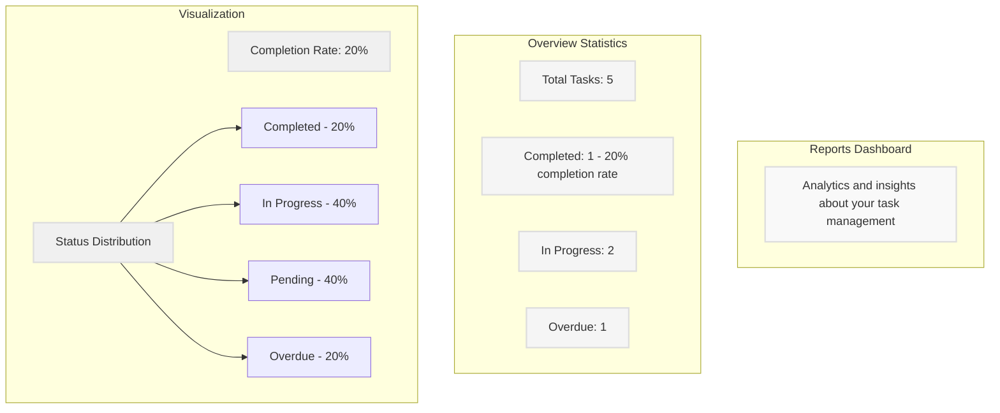

```mermaid
graph TD
    subgraph "Reports Dashboard"
    A[Analytics and insights about your task management]
    end
    
    subgraph "Overview Statistics"
    B[Total Tasks: 5]
    C[Completed: 1 - 20% completion rate]
    D[In Progress: 2]
    E[Overdue: 1]
    end
    
    subgraph "Visualization"
    F[Completion Rate: 20%]
    G[Status Distribution]
    
    G1[Completed - 20%]
    G2[In Progress - 40%]
    G3[Pending - 40%]
    G4[Overdue - 20%]
    
    G --> G1
    G --> G2
    G --> G3
    G --> G4
    end
    
    style A fill:#f9f9f9,stroke:#ddd,stroke-width:2px
    style B fill:#f5f5f5,stroke:#ddd,stroke-width:2px
    style C fill:#f5f5f5,stroke:#ddd,stroke-width:2px
    style D fill:#f5f5f5,stroke:#ddd,stroke-width:2px
    style E fill:#f5f5f5,stroke:#ddd,stroke-width:2px
    style F fill:#f0f0f0,stroke:#ddd,stroke-width:2px
    style G fill:#f0f0f0,stroke:#ddd,stroke-width:2px
``` 