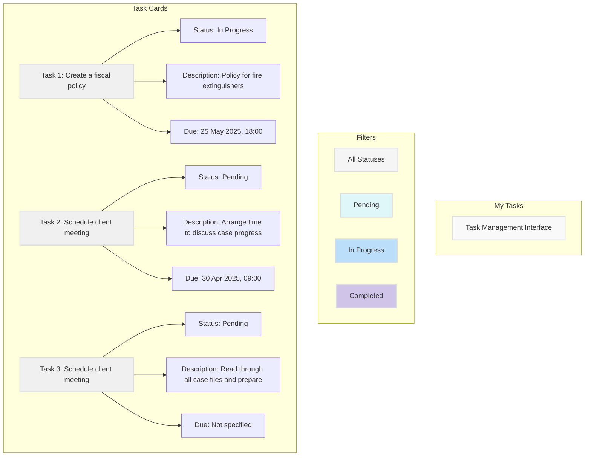

```mermaid
graph TD
    subgraph "My Tasks"
    A[Task Management Interface]
    end
    
    subgraph "Filters"
    B[All Statuses]
    C[Pending]
    D[In Progress]
    E[Completed]
    end
    
    subgraph "Task Cards"
    F[Task 1: Create a fiscal policy]
    F1[Status: In Progress]
    F2[Description: Policy for fire extinguishers]
    F3[Due: 25 May 2025, 18:00]
    
    G[Task 2: Schedule client meeting]
    G1[Status: Pending]
    G2[Description: Arrange time to discuss case progress]
    G3[Due: 30 Apr 2025, 09:00]
    
    H[Task 3: Schedule client meeting]
    H1[Status: Pending]
    H2[Description: Read through all case files and prepare]
    H3[Due: Not specified]
    
    F --> F1
    F --> F2
    F --> F3
    
    G --> G1
    G --> G2
    G --> G3
    
    H --> H1
    H --> H2
    H --> H3
    end
    
    style A fill:#f9f9f9,stroke:#ddd,stroke-width:2px
    style B fill:#f5f5f5,stroke:#ddd,stroke-width:2px
    style C fill:#e0f7fa,stroke:#ddd,stroke-width:2px
    style D fill:#bbdefb,stroke:#ddd,stroke-width:2px
    style E fill:#d1c4e9,stroke:#ddd,stroke-width:2px
    style F fill:#f0f0f0,stroke:#ddd,stroke-width:2px
    style G fill:#f0f0f0,stroke:#ddd,stroke-width:2px
    style H fill:#f0f0f0,stroke:#ddd,stroke-width:2px
``` 