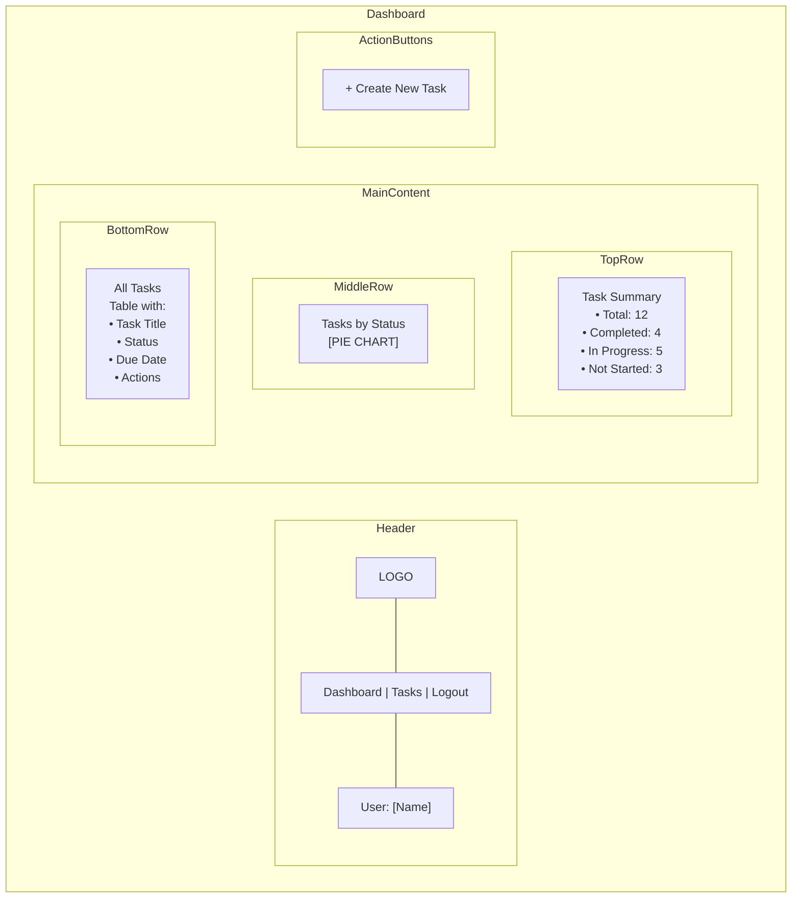
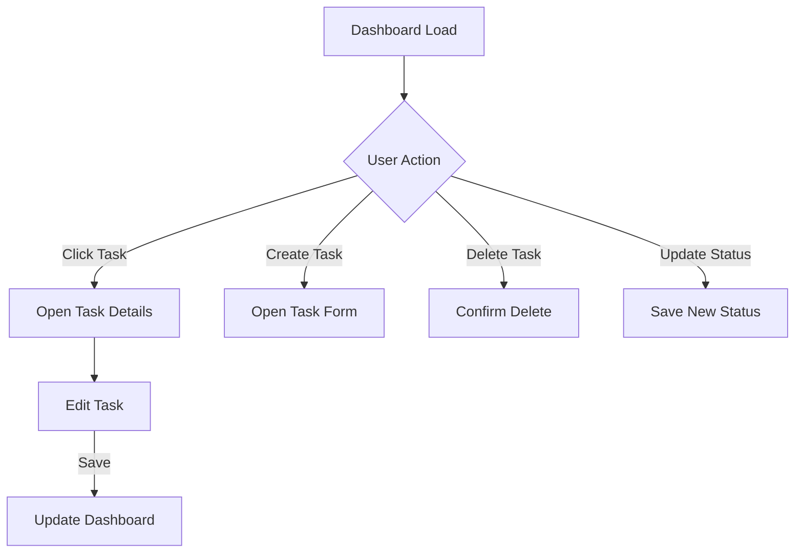
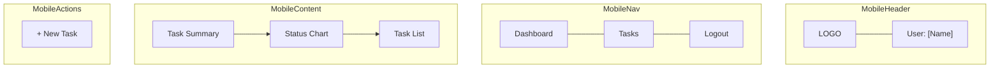

# Dashboard Wireframe - Task Management System

This wireframe demonstrates the dashboard layout for the Task Management System using Mermaid diagram syntax.

## Dashboard Layout

## Interactive Elements

## Mobile View Adaptation

## Notes for Implementation

1. The dashboard should load with task summary statistics at the top
2. Status chart should use consistent colors for each status type
3. Task list should support basic sorting by column
4. All interactive elements should have hover states for desktop
5. Mobile view should stack elements vertically for better readability 