# Dashboard Wireframe - Task Management System

This wireframe demonstrates the dashboard layout for the Task Management System using Mermaid diagram syntax.

## Dashboard Layout

```mermaid
graph TD
    subgraph Dashboard
        subgraph Header
            Logo["LOGO"] --- NavBar
            NavBar["Dashboard | Tasks | Calendar | Profile"] --- SearchBar["🔍"]
        end
        
        subgraph MainContent
            subgraph TopRow
                TaskSummary["Task Summary<br/>• Total: 24<br/>• Completed: 12<br/>• Overdue: 3"] --- TasksByStatus["Tasks by Status<br/>[PIE CHART]"]
            end
            
            subgraph MiddleRow
                UpcomingDeadlines["Upcoming Deadlines<br/>Table with:<br/>• Task Title<br/>• Status<br/>• Due Date"]
            end
            
            subgraph BottomRow
                Calendar["Calendar View<br/>[Shows tasks across days]"]
            end
        end
        
        subgraph Footer
            Copyright["© 2023 HMCTS"] --- HelpLink["Help | About"]
        end
    end
```

## Interactive Elements

## Mobile View Adaptation

```mermaid
flowchart TD
    subgraph MobileHeader
        Logo["LOGO"] --- MenuIcon["☰"] --- SearchIcon["🔍"]
    end
    
    subgraph MobileContent
        Summary["Task Summary"] --> DeadlinesList["Upcoming Deadlines"] --> QuickActions["Quick Actions"]
    end
    
    subgraph BottomNav
        Home["🏠"] --- Tasks["📋"] --- Calendar["📅"] --- Profile["👤"]
    end
```

## Notes for Implementation

1. The dashboard should load with the most critical information first (task counts and urgent items)
2. Interactive elements should provide immediate visual feedback on hover/touch
3. All charts should maintain the application's color scheme and support both light/dark themes
4. Calendar view should feature a clear indication of current date and task density 