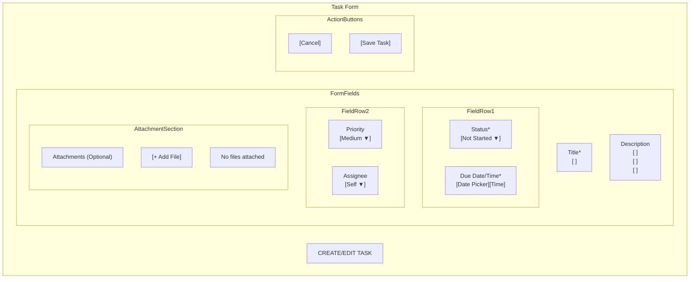
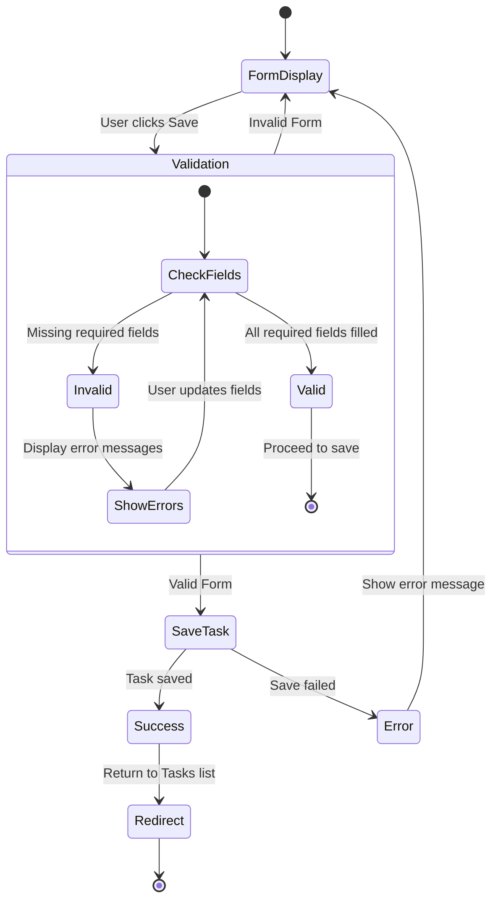
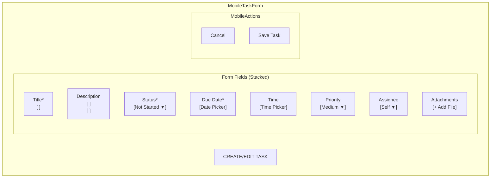
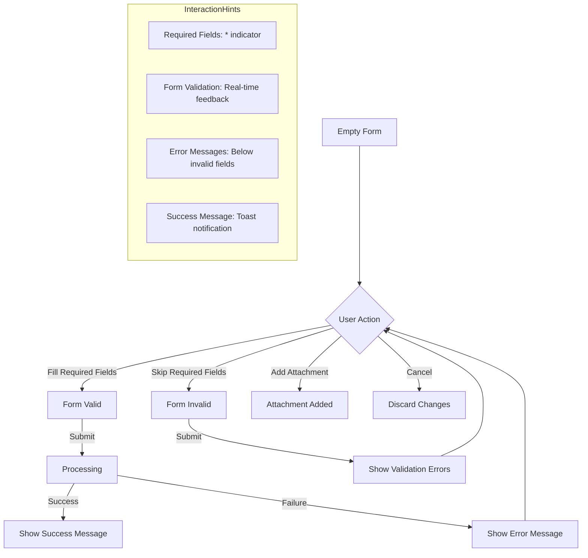

# Task Form Wireframe - Task Management System

This wireframe demonstrates the task creation and edit form for the Task Management System using Mermaid diagram syntax.

## Task Form Layout

## Form Validation Flow

## Mobile Adaptation

## Form Interaction States

## Implementation Notes

1. All required fields should be clearly marked with an asterisk (*)
2. Form validation should occur in real-time as users complete fields
3. The form should maintain state if submission fails to prevent data loss
4. Consider implementing auto-save functionality for long form entries
5. Mobile view should use full width but maintain the same validation logic
6. Prioritize high-contrast field outlines and clear error messages for accessibility 