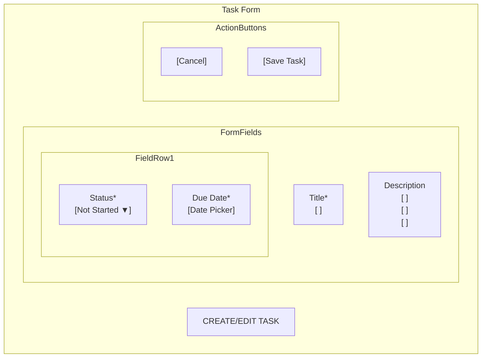
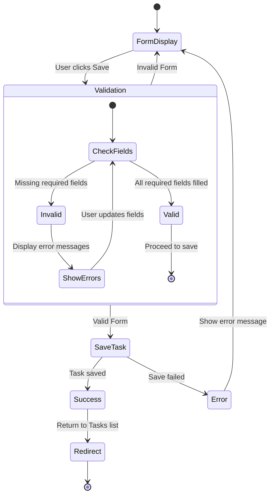
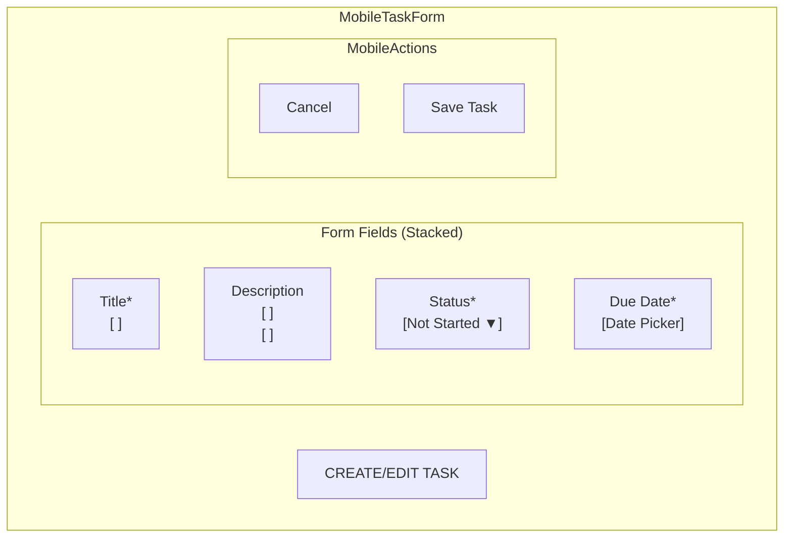

# Task Form Wireframe - Task Management System

This wireframe demonstrates the task creation and edit form for the Task Management System using Mermaid diagram syntax.

## Task Form Layout

## Form Validation Flow

## Mobile Adaptation

## Implementation Notes

1. All required fields should be clearly marked with an asterisk (*)
2. Form validation should verify that Title and Status are provided
3. Date picker should default to current date
4. Error messages should appear below the invalid fields
5. Mobile view should use the full width of the screen
6. Save button should be disabled until all required fields are completed 